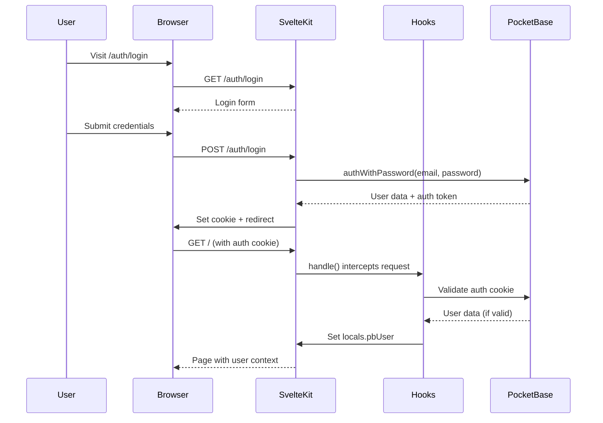
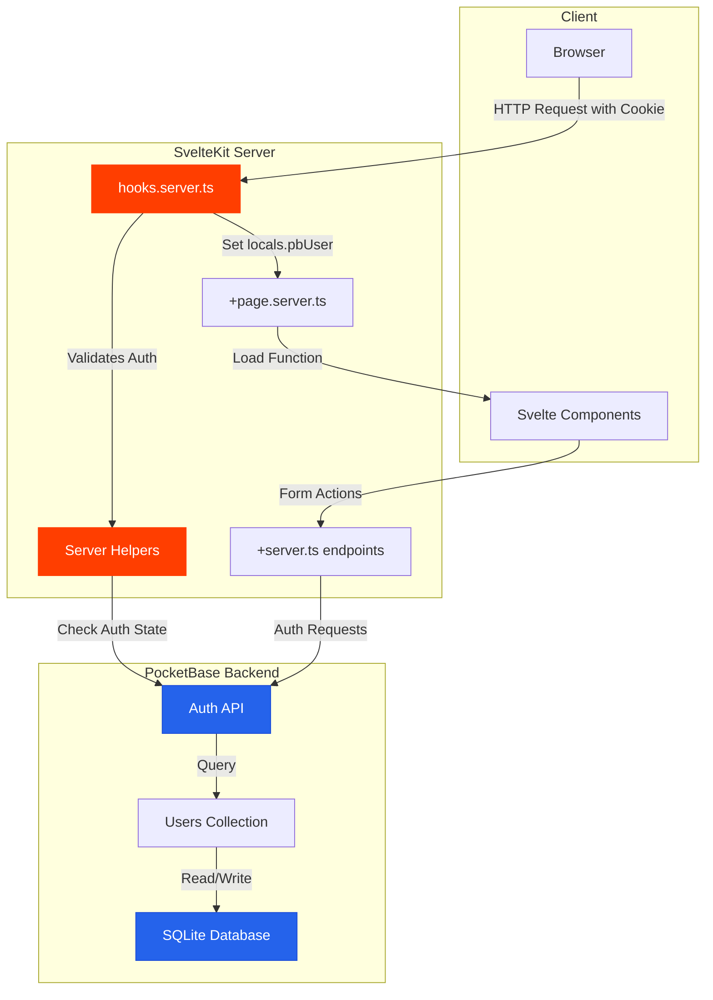
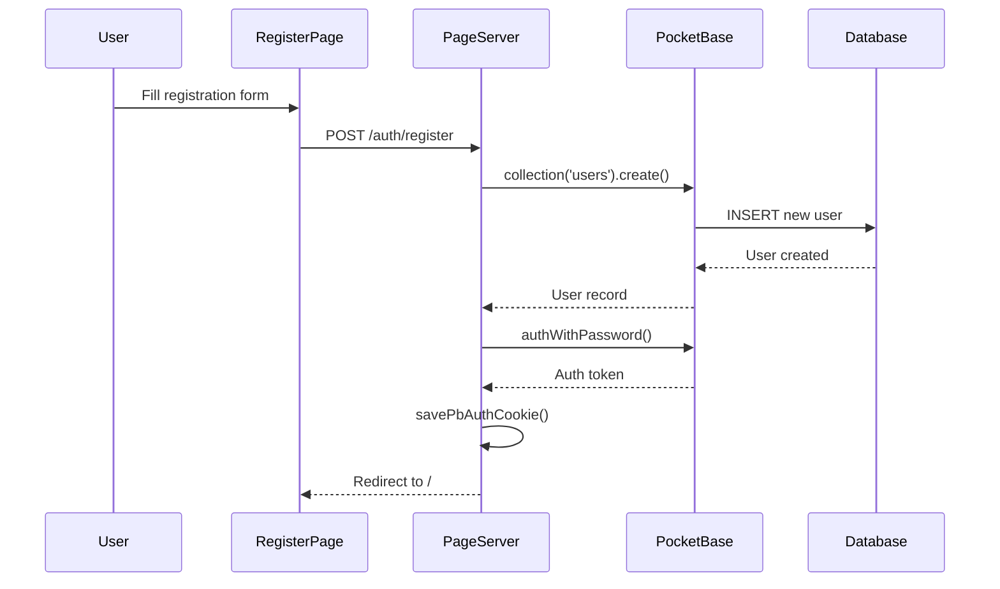
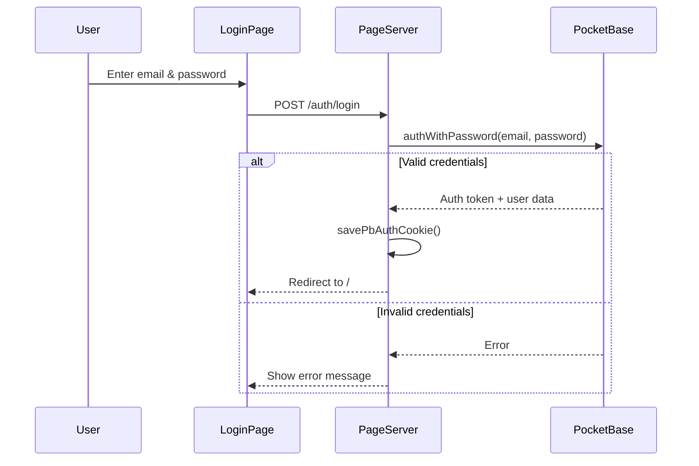
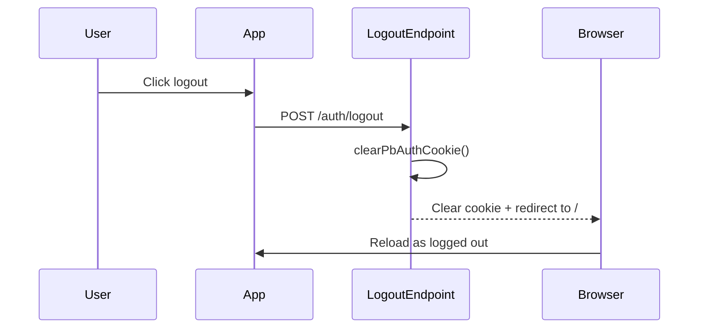
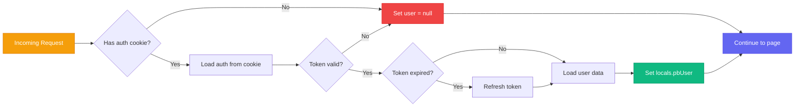

PocketKit comes with a complete authentication system built on PocketBase. This guide explains how it works and how to customize it.

## Authentication Flow

PocketKit uses cookie-based authentication with server-side session validation. Here's how the complete flow works:



## Architecture Overview



## Key Components

### 1. Client-Side PocketBase Instance

Location: `app/src/lib/pocketbase.ts`

```typescript
export const pb = new PocketBase(
  env.PUBLIC_POCKETBASE_URL || 'http://127.0.0.1:8090'
);

export const currentUser = writable(pb.authStore.record);

pb.authStore.onChange(() => {
  currentUser.set(pb.authStore.record);
});
```

**Purpose:**
- Creates a PocketBase client that runs in the browser
- Manages real-time auth state updates
- Provides a Svelte store for reactive user data

### 2. Server-Side PocketBase Helpers

Location: `app/src/lib/server/pocketbase.ts`

This file contains several helper functions for server-side auth:

#### `createServerPb()`
Creates a fresh PocketBase instance for server use.

#### `createServerPbWithAuth(event)`
Creates a PocketBase instance and loads auth from cookies.

#### `savePbAuthCookie(event, pb)`
Saves the current auth state to an HTTP-only cookie.

#### `clearPbAuthCookie(event)`
Removes the auth cookie (for logout).

#### `validatePbAuth(pb)`
Validates the current session and refreshes the token if needed.

### 3. Server Hooks

Location: `app/src/hooks.server.ts`

The server hook runs on **every request** before any page loads:

```typescript
export const handle: Handle = async ({ event, resolve }) => {
  const pb = createServerPbWithAuth(event);
  const user = await validatePbAuth(pb);

  if (user) {
    event.locals.pbUser = {
      id: user.id,
      email: user.email,
      // ... other user fields
    };
    savePbAuthCookie(event, pb);
  } else {
    event.locals.pbUser = null;
    clearPbAuthCookie(event);
  }

  return resolve(event);
};
```

**What this does:**
1. Creates a PocketBase instance with auth from cookies
2. Validates the auth token (and refreshes if needed)
3. Sets `event.locals.pbUser` for use in server-side code
4. Updates or clears the auth cookie
5. Continues to the requested page

### 4. Layout Load Function

Location: `app/src/routes/+layout.server.ts`

```typescript
export const load: LayoutServerLoad = async ({ locals }) => {
  return {
    user: locals.pbUser
  };
};
```

This makes the user data available to all pages via `$page.data.user`.

## Authentication Flows

### Registration Flow



Location: `app/src/routes/auth/register/+page.server.ts`

Key steps:
1. Create user record in PocketBase
2. Automatically log them in
3. Save auth cookie
4. Redirect to home page

### Login Flow



Location: `app/src/routes/auth/login/+page.server.ts`

### Logout Flow



Location: `app/src/routes/auth/logout/+server.ts`

### Session Validation on Every Request



This happens automatically in `hooks.server.ts` for every request.

## Security Features

### HTTP-Only Cookies

Auth tokens are stored in HTTP-only cookies, which means:
- JavaScript cannot access them (prevents XSS attacks)
- Automatically sent with every request
- Secure flag in production (HTTPS only)

Configuration in `savePbAuthCookie()`:

```typescript
event.cookies.set(pbCookieName, match[1], {
  httpOnly: true,           // Not accessible via JavaScript
  secure: import.meta.env.PROD,  // HTTPS only in production
  sameSite: 'lax',          // CSRF protection
  path: '/',                // Available to all routes
  maxAge: 60 * 60 * 24 * 7  // 7 days
});
```

### Token Refresh

Tokens are automatically refreshed in `validatePbAuth()`:

```typescript
export async function validatePbAuth(pb: PocketBase) {
  if (!pb.authStore.isValid) {
    return null;
  }

  try {
    await pb.collection('users').authRefresh();
    return pb.authStore.record;
  } catch {
    pb.authStore.clear();
    return null;
  }
}
```

This ensures sessions stay valid without requiring re-login.

### Server-Side Validation

All auth checks happen server-side in `hooks.server.ts`. The client never makes trust decisions about authentication.

## Protecting Routes

### Server-Side Protection

Add checks in your `+page.server.ts` or `+server.ts` files:

```typescript
import { error } from '@sveltejs/kit';
import type { PageServerLoad } from './$types';

export const load: PageServerLoad = async ({ locals }) => {
  if (!locals.pbUser) {
    throw error(401, 'Unauthorized');
  }

  // Protected content here
  return {
    // ... data
  };
};
```

### Client-Side UI

In your Svelte components, use the user data from the layout:

```svelte
<script lang="ts">
  import { page } from '$app/stores';

  $: user = $page.data.user;
</script>

{#if user}
  <p>Welcome, {user.email}!</p>
  <a href="/auth/logout">Logout</a>
{:else}
  <a href="/auth/login">Login</a>
{/if}
```

## Customizing Authentication

### Add OAuth Providers

PocketBase supports OAuth2 providers (Google, Facebook, GitHub, etc.).

1. Go to PocketBase Admin → Settings → Auth providers
2. Enable and configure your providers
3. Update your login page to include OAuth buttons
4. Use `pb.collection('users').authWithOAuth2()`

### Email Verification

Enable in PocketBase Admin:
1. Settings → Mail settings (configure SMTP)
2. Collections → users → Options
3. Enable "Require email verification"

### Password Reset

PocketBase provides built-in password reset:

```typescript
// Request password reset
await pb.collection('users').requestPasswordReset('user@example.com');

// Confirm with token
await pb.collection('users').confirmPasswordReset(
  token,
  newPassword,
  newPasswordConfirm
);
```

### Custom User Fields

Add fields to the users collection in PocketBase Admin:
1. Collections → users → Fields
2. Add your custom fields (e.g., "name", "avatar", "role")
3. Update the `PbUser` type in `app/src/lib/server/pocketbase.ts`

## TypeScript Types

The user type is defined in `app/src/lib/server/pocketbase.ts`:

```typescript
export type PbUser = {
  id: string;
  email: string;
  username?: string;
  verified: boolean;
  created: string;
  updated: string;
};
```

And made available via app types in `app/src/app.d.ts`:

```typescript
declare namespace App {
  interface Locals {
    pbUser: PbUser | null;
  }
}
```

## Testing Authentication

### Create Test Users

Via PocketBase Admin:
1. Visit http://localhost:8090/_ (or your production URL + `/_`)
2. Go to Collections → users
3. Click "New record"
4. Fill in email and password
5. Save

Via API:
```typescript
const user = await pb.collection('users').create({
  email: 'test@example.com',
  password: 'testpassword123',
  passwordConfirm: 'testpassword123'
});
```

### Test Login Flow

1. Visit `/auth/register` and create an account
2. Check that you're redirected to `/` and see your email
3. Click logout
4. Visit `/auth/login` and log back in
5. Verify session persists after page refresh

## Common Issues

### Session Lost on Page Reload

**Cause**: Cookie not being saved correctly

**Fix**:
- Check `PUBLIC_POCKETBASE_URL` environment variable
- Ensure CORS is configured in PocketBase
- Verify cookies are being set (check DevTools → Application → Cookies)

### "Invalid or expired token"

**Cause**: Token validation failed

**Fix**:
- Clear cookies and log in again
- Check that PocketBase backend is running
- Verify the auth refresh endpoint is working

### Can't Log In After Registration

**Cause**: Email verification might be required

**Fix**:
- Check PocketBase settings for email verification requirements
- Disable email verification for development
- Configure SMTP for production email verification

## Next Steps

Now that you understand authentication:
- Explore the [PocketBase documentation](https://pocketbase.io/docs/) for advanced features
- Learn about [PocketBase realtime subscriptions](https://pocketbase.io/docs/api-realtime/)
- Add role-based access control using custom user fields
- Implement multi-factor authentication using PocketBase plugins
