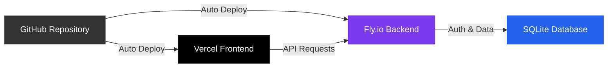
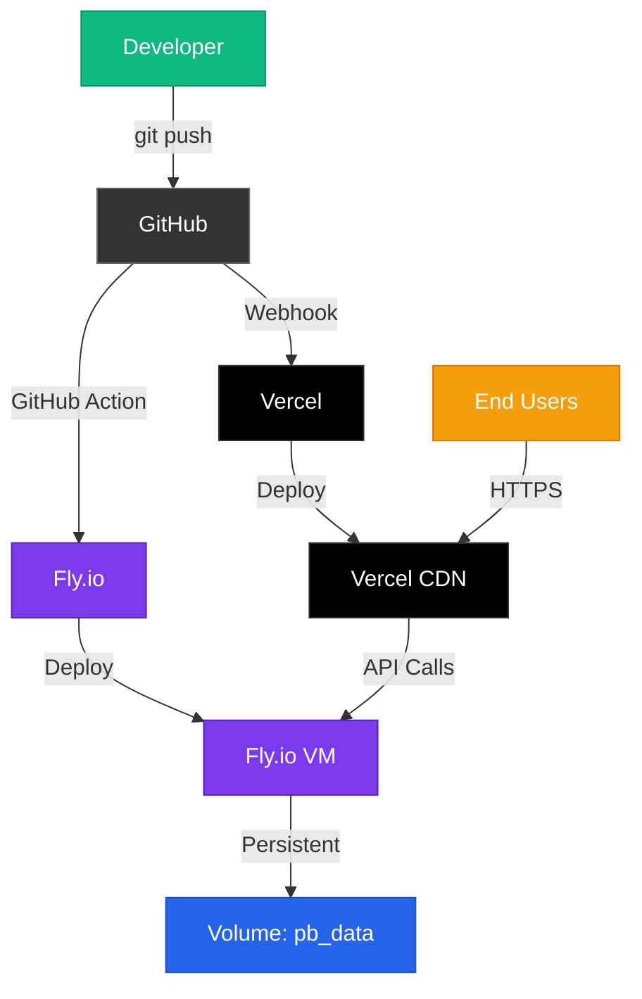

import { Tabs, TabItem } from '@astrojs/starlight/components';

This guide covers deploying PocketKit to production using free hosting:
- **Frontend (SvelteKit)** → Vercel
- **Backend (PocketBase)** → Fly.io

Both platforms offer generous free tiers perfect for side projects and small applications.

## Overview



## Part 1: Deploy Backend to Fly.io

### Install Fly.io CLI

First, install the Fly.io CLI:

**macOS/Linux:**
```bash
curl -L https://fly.io/install.sh | sh
```

**Windows:**
```powershell
powershell -Command "iwr https://fly.io/install.ps1 -useb | iex"
```

### Sign Up and Login

```bash
flyctl auth signup  # Create account (or use flyctl auth login if you have one)
```

### Configure Your App

Update `server/fly.toml` with your app name:

```toml
app = 'your-app-name-server'  # Change this to your unique name
primary_region = 'ams'         # Choose region closest to your users
```

:::tip[Choose a Region]
Common regions: `ams` (Amsterdam), `iad` (Virginia), `sjc` (San Jose), `syd` (Sydney).
See all regions with `flyctl platform regions`.
:::

### Update PocketBase Version

Check the latest PocketBase version at [pocketbase.io](https://github.com/pocketbase/pocketbase/releases) and update `server/Dockerfile`:

```dockerfile
ARG PB_VERSION=0.36.0  # Update to latest version
```

### Launch Your App

Navigate to the server directory and launch:

```bash
cd server
flyctl launch
```

This will:
1. Read your `fly.toml` configuration
2. Create the app on Fly.io
3. Open a browser to review settings
4. Ask if you want to deploy now (say **No** - we need to set up storage first)

### Create Persistent Storage

PocketBase needs persistent storage for the SQLite database:

```bash
flyctl volumes create pb_data --region ams --size 1
```

This creates a 1GB volume in the Amsterdam region (or your chosen region).

:::caution[Important]
Without persistent storage, your database will be reset every time the app restarts!
:::

### Deploy

Now deploy your app:

```bash
flyctl deploy
```

Your backend is now live at `https://your-app-name-server.fly.dev`

### Set Up Admin Account

Create a superuser account to access the PocketBase admin:

```bash
flyctl ssh console
/pb/pocketbase superuser create admin@example.com yourpassword
```

Or update an existing one:

```bash
flyctl ssh console
/pb/pocketbase superuser update admin@example.com newpassword
```

### Verify Backend

Visit your app's admin panel:
```
https://your-app-name-server.fly.dev/_
```

Log in with your superuser credentials.

## Part 2: Deploy Frontend to Vercel

### Install Vercel CLI (Optional)

You can deploy via GitHub integration (recommended) or CLI:

<Tabs syncKey="package-managers">
  <TabItem label="yarn">
  ```bash
  yarn global add vercel
  ```
  </TabItem>
  <TabItem label="pnpm">
  ```bash
  pnpm add -g vercel
  ```
  </TabItem>
  <TabItem label="npm">
  ```bash
  npm i -g vercel
  ```
  </TabItem>
</Tabs>

### Connect to GitHub

1. Push your code to GitHub (if not already there)
2. Go to [vercel.com](https://vercel.com)
3. Sign up or log in with GitHub
4. Click **Add New Project**
5. Import your PocketKit repository

### Configure Project

When setting up the project:

1. **Framework Preset**: SvelteKit (should be auto-detected)
2. **Root Directory**: `app`
3. **Output Directory**: `.svelte-kit` (default)

<Tabs syncKey="package-managers">
  <TabItem label="yarn">
  **Build Command**: `yarn build` (default)
  </TabItem>
  <TabItem label="pnpm">
  **Build Command**: `pnpm build`
  </TabItem>
  <TabItem label="npm">
  **Build Command**: `npm run build` (default)
  </TabItem>
</Tabs>

### Set Environment Variables

Add the following environment variable in Vercel:

**Key**: `PUBLIC_POCKETBASE_URL`
**Value**: `https://your-app-name-server.fly.dev`

:::note
This tells your frontend where to find your PocketBase backend.
:::

To add this:
1. Go to your project settings in Vercel
2. Navigate to **Environment Variables**
3. Add `PUBLIC_POCKETBASE_URL` with your Fly.io URL
4. Make sure it's set for **Production**, **Preview**, and **Development**

### Deploy

Click **Deploy** and Vercel will:
1. Build your SvelteKit app
2. Deploy it globally on their CDN
3. Give you a production URL

Your frontend is now live at `https://your-app-name.vercel.app`

## Part 3: Set Up Automatic Deployment

### Automatic Vercel Deployment

Vercel automatically deploys when you push to your main branch. No additional setup needed!

### Automatic Fly.io Deployment

Set up GitHub Actions to auto-deploy your backend:

#### 1. Get Fly.io Deploy Token

```bash
flyctl tokens create deploy
```

Copy the token that's displayed.

#### 2. Add Token to GitHub Secrets

1. Go to your GitHub repository
2. Navigate to **Settings** → **Secrets and variables** → **Actions**
3. Click **New repository secret**
4. Name: `FLY_API_TOKEN`
5. Value: Paste your token
6. Click **Add secret**

#### 3. Create GitHub Actions Workflow

Create `.github/workflows/fly-deploy.yml`:

```yaml
name: Deploy to Fly.io

on:
  push:
    branches:
      - main
    paths:
      - 'server/**'

jobs:
  deploy:
    name: Deploy PocketBase
    runs-on: ubuntu-latest
    steps:
      - uses: actions/checkout@v3

      - uses: superfly/flyctl-actions/setup-flyctl@master

      - name: Check for changes
        id: changes
        run: |
          if git diff --quiet HEAD^ HEAD -- server/; then
            echo "no_changes=true" >> $GITHUB_ENV
          else
            echo "no_changes=false" >> $GITHUB_ENV
          fi

      - name: Deploy to Fly.io
        if: env.no_changes == 'false'
        run: |
          cd server
          flyctl deploy --remote-only -a your-app-name-server
        env:
          FLY_API_TOKEN: ${{ secrets.FLY_API_TOKEN }}
```

:::caution
Replace `your-app-name-server` with your actual Fly.io app name!
:::

Now, when you push changes to the `server/` directory, GitHub Actions will automatically deploy to Fly.io.

## Deployment Architecture



## Post-Deployment Checklist

After deploying both frontend and backend:

- [ ] Visit your Vercel URL and verify the app loads
- [ ] Test registration at `/auth/register`
- [ ] Test login at `/auth/login`
- [ ] Verify the backend connection in browser DevTools (Network tab)
- [ ] Check PocketBase admin at `your-backend.fly.dev/_`
- [ ] Verify auto-deployment by making a small change and pushing

## Monitoring and Maintenance

### Fly.io Monitoring

View logs and monitor your backend:

```bash
flyctl logs              # View recent logs
flyctl status            # Check app status
flyctl scale show        # View current scaling
```

### Fly.io Auto-start/Auto-stop

The configuration in `fly.toml` includes:

```toml
auto_stop_machines = 'stop'
auto_start_machines = true
min_machines_running = 0
```

This means:
- Your app stops when idle (saves resources on free tier)
- Automatically starts when receiving requests
- First request after idle may take a few seconds

### Vercel Monitoring

1. Go to your project dashboard on Vercel
2. View **Deployments** for deployment history
3. Check **Analytics** for traffic insights
4. Monitor **Functions** for serverless function performance

## Scaling Considerations

### Free Tier Limits

**Vercel Free Tier:**
- 100 GB bandwidth per month
- Unlimited projects
- Automatic SSL
- Global CDN

**Fly.io Free Tier:**
- 3 shared-cpu-1x VMs
- 3GB persistent storage
- 160GB outbound data transfer

### Upgrading

As your app grows:
- **Vercel**: Upgrade to Pro ($20/month) for better analytics and team features
- **Fly.io**: Scale with `flyctl scale vm` or add more regions

## Troubleshooting

### Frontend Can't Connect to Backend

Check these common issues:
1. Verify `PUBLIC_POCKETBASE_URL` in Vercel environment variables
2. Ensure the URL starts with `https://` (not `http://`)
3. Make sure there's no trailing slash: `https://app.fly.dev` ✅ vs `https://app.fly.dev/` ❌
4. Check CORS settings in PocketBase admin (should allow your Vercel domain)

### Fly.io Deployment Fails

Common fixes:
1. Ensure you created the persistent volume
2. Check `fly.toml` app name matches your actual app
3. Verify Dockerfile PocketBase version is valid
4. Run `flyctl doctor` to diagnose issues

### Database Reset After Deployment

This happens if the persistent volume isn't mounted correctly:
1. Verify volume exists: `flyctl volumes list`
2. Check `fly.toml` mounts configuration matches volume name
3. Volume must be in the same region as your app

## Next Steps

Now that your app is deployed:

- Learn about [Authentication](/concepts/auth/) to customize the auth flow
- Set up custom domains in Vercel and Fly.io
- Configure email settings in PocketBase for password resets
- Add real-time features using PocketBase subscriptions
